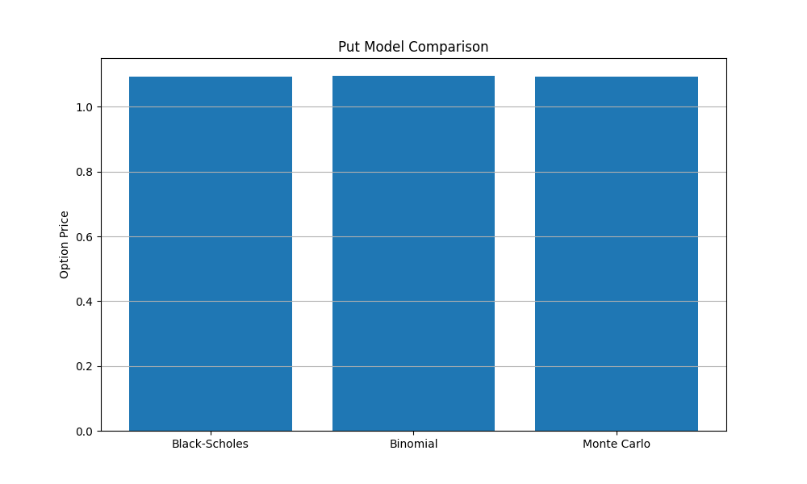
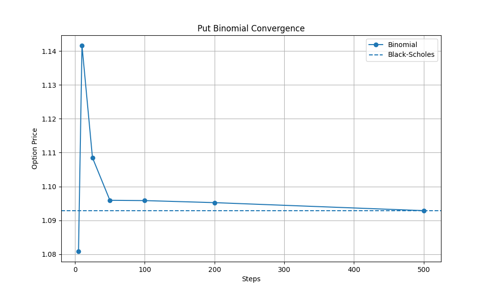
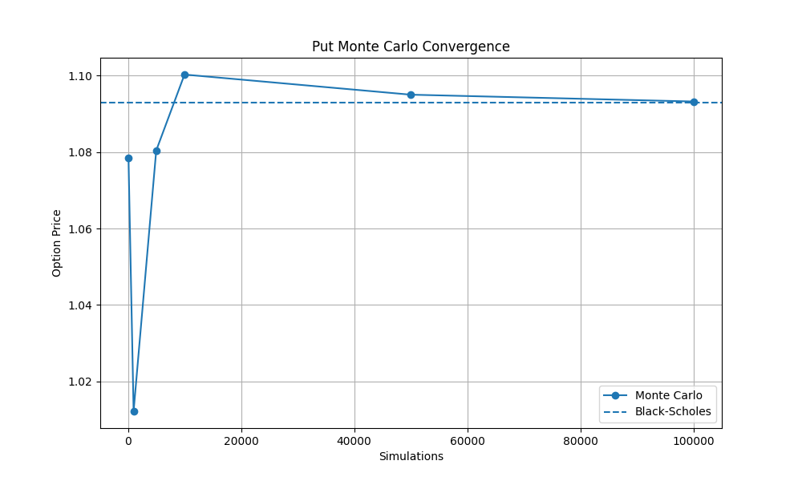
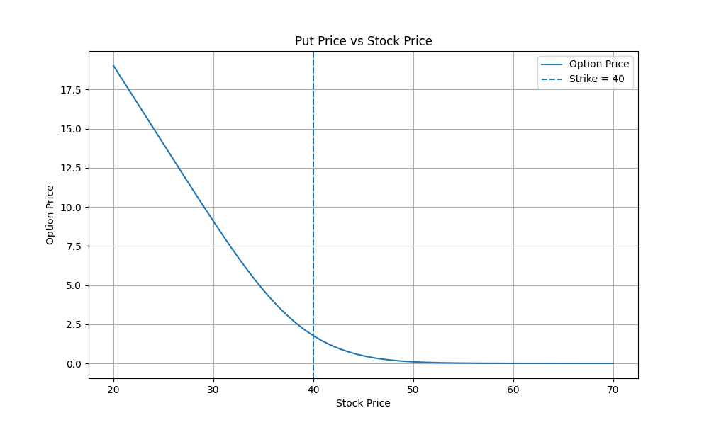
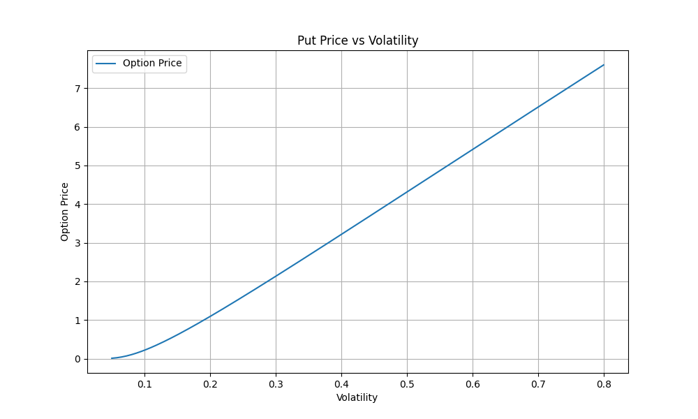
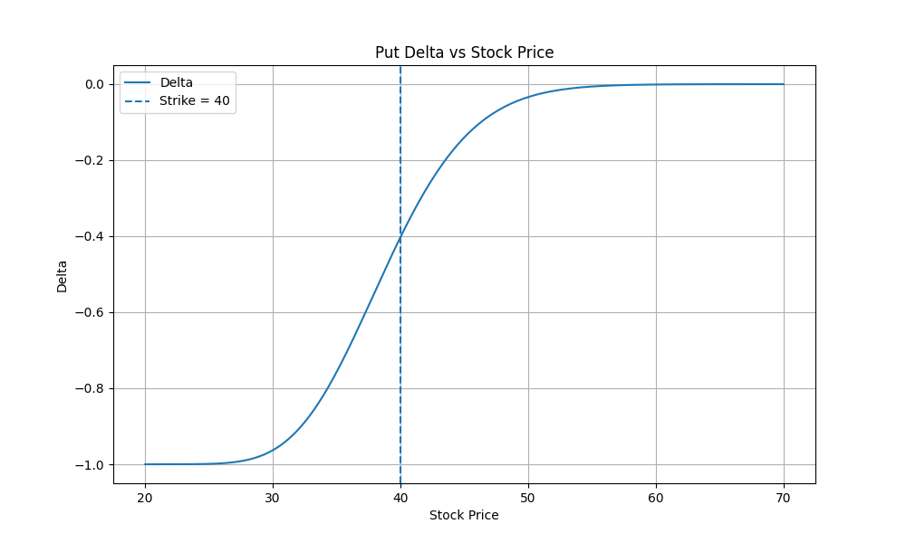
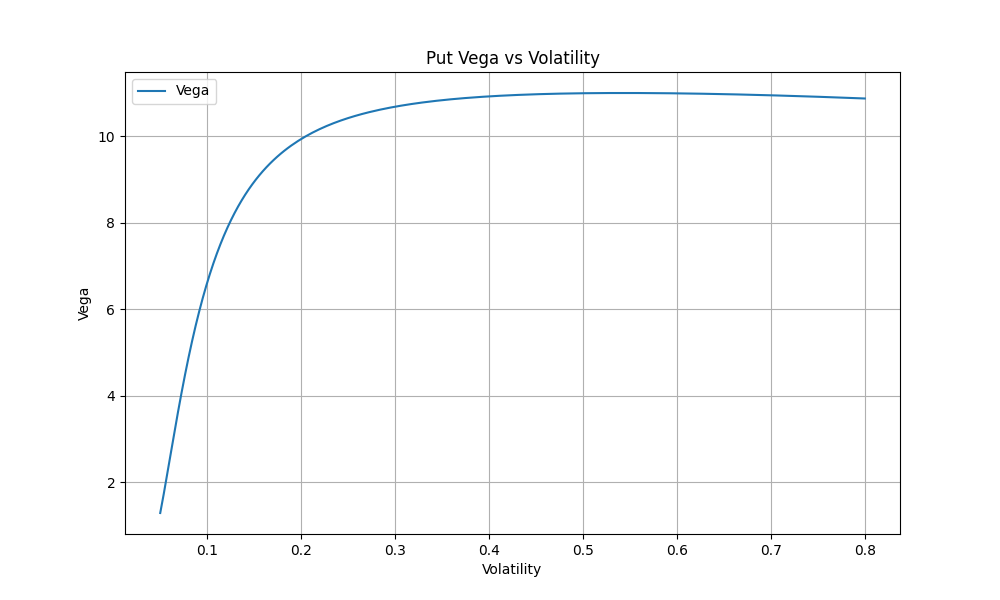
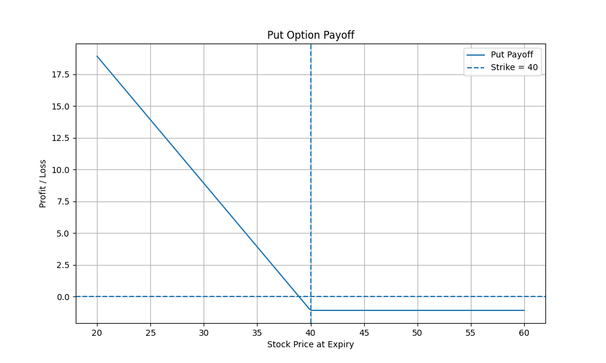

# Options Pricing Engine

A Python-based options pricing engine implementing multiple pricing models, Greeks, and quantitative analysis tools for European options.

---

## Overview

This project builds a modular options pricing library from scratch, implementing:

* Analytical pricing (Black-Scholes)
* Numerical methods (Binomial Tree)
* Simulation methods (Monte Carlo)
* Greeks (risk sensitivities)
* Implied volatility solver
* Convergence and sensitivity analysis
* Visualisation and notebook-based exploration

The goal is to demonstrate both **quantitative finance knowledge** and **software engineering skills** relevant to quantitative developer roles.

---

## Features

* Black-Scholes pricing model
* Binomial tree pricing model
* Monte Carlo simulation pricing
* Greeks calculation:

  * Delta
  * Gamma
  * Vega
  * Theta
  * Rho
* Implied volatility solver (numerical root finding)
* Model comparison and convergence analysis
* Sensitivity analysis and payoff visualisation
* Jupyter notebook for interactive analysis
* Full test suite using `pytest`

---

## Project Structure

```
Options_Pricing_Engine/
│
├── src/
│   ├── models/           # Pricing models
│   ├── greeks/           # Greeks calculations
│   ├── utils/            # Helpers, validation, implied volatility
│   ├── visualisation/    # Plotting functions
│   └── main.py           # Example execution
│
├── tests/                # Unit tests
├── notebooks/            # Analysis notebook
├── outputs/figures/      # Generated figures
├── examples/             # Example scripts (e.g. export figures)
│
├── requirements.txt
└── README.md
```

---

## Models Implemented

### Black-Scholes

Closed-form analytical solution for pricing European options under log-normal assumptions.

### Binomial Tree

Discrete-time model that approximates the continuous price process and converges to Black-Scholes as the number of steps increases.

### Monte Carlo

Simulation-based approach using random sampling of price paths, useful for more complex derivatives.

---

## Example Results

### Model Comparison



### Binomial Convergence



### Monte Carlo Convergence



---

## Sensitivity Analysis

### Price vs Stock Price



### Price vs Volatility



### Delta vs Stock Price



### Vega vs Volatility



---

## Payoff Diagram



---

## Example Usage

```python
from models.black_scholes import black_scholes_price

price = black_scholes_price("call", 42, 40, 0.5, 0.05, 0.2)
print(price)
```

---

## Running the Project

### Install dependencies

```
pip install -r requirements.txt
```

### Run example

```
python src/main.py
```

### Export all figures

```
python examples/export_figures.py
```

---

## Testing

Run all tests with:

```
pytest
```

---

## Notebook Analysis

See:

```
notebooks/options_pricing_analysis.ipynb
```

Includes:

* Model comparisons
* Convergence analysis
* Sensitivity plots
* Greeks interpretation

---

## Future Improvements

* Real market data integration (e.g. using yfinance)
* Volatility surface / volatility smile
* American options pricing
* Performance optimisation (NumPy / C++)
* Strategy development using model mispricing

---

## Author

Olly Newport
